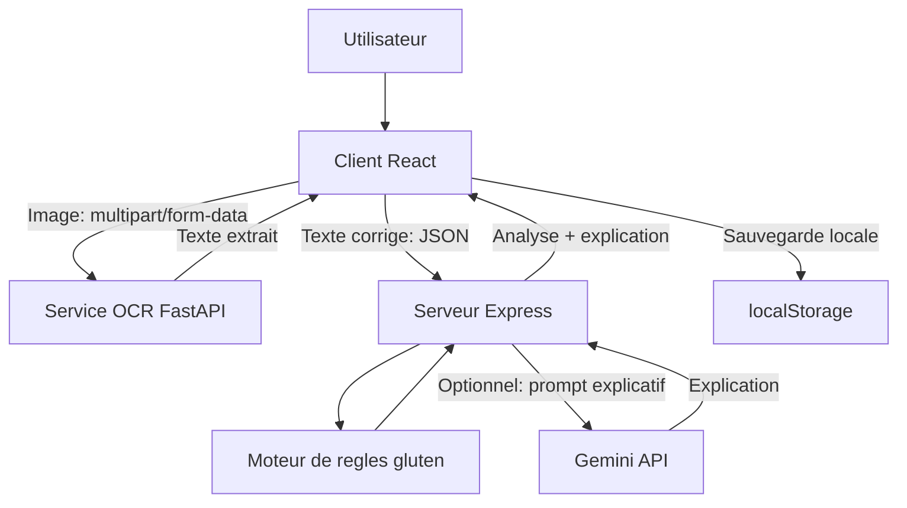

# Architecture

## Structure generale

Le projet suit une architecture decoupee en trois services locaux :

- `client/` : application React chargee de l'experience utilisateur.
- `server/` : API Express qui applique la logique metier et produit les explications.
- `ocr-service/` : API FastAPI dediee a l'OCR.

Chaque service peut demarrer separement. Le script `start_gluti_safe.ps1` lance les trois services dans des fenetres PowerShell distinctes.

## Role du client

Le client React se trouve dans `client/`.

Responsabilites principales :

- Afficher les pages principales de l'application.
- Gerer la selection d'image ou la saisie manuelle.
- Appeler le service OCR via `client/src/lib/ocrApi.js`.
- Appeler l'API Node via `client/src/lib/api.js`.
- Afficher le resultat d'analyse.
- Sauvegarder l'historique dans `localStorage`.

Routes actives dans `client/src/App.jsx` :

| Route | Composant | Role |
|---|---|---|
| `/` | `HomePage` | Tableau de bord |
| `/analyse` | `AnalysisPage` | Page d'analyse active |
| `/history` | `HistoryPage` | Historique local |
| `/profile` | `ProfilePage` | Profil local |
| `/register` | `AuthPage` | Creation de profil local |
| `/login` | `AuthPage` | Connexion locale |

## Role du serveur Node

Le serveur se trouve dans `server/`.

Responsabilites principales :

- Exposer les endpoints `/api/*`.
- Normaliser et analyser les ingredients.
- Classer le resultat en `CONTAINS_GLUTEN`, `POSSIBLE_RISK`, `NO_GLUTEN_DETECTED` ou `INSUFFICIENT_INFO`.
- Generer une explication en francais via Gemini ou fallback local.

Fichiers principaux :

- `server/index.js` : initialisation Express, CORS, JSON body parser, health check.
- `server/routes/analyze.js` : endpoints d'analyse et d'explication.
- `server/lib/glutenRules.js` : moteur de regles.
- `server/lib/explain.js` : selection Gemini ou fallback.
- `server/lib/gemini.js` : client Gemini.

## Role du service OCR

Le service OCR se trouve dans `ocr-service/`.

Responsabilites principales :

- Recevoir une image en `multipart/form-data`.
- Sauvegarder temporairement l'image dans `OCR_TEMP_DIR`.
- Verifier que le fichier est lisible avec Pillow.
- Extraire le texte via EasyOCR.
- Nettoyer legerement le texte extrait.
- Supprimer le fichier temporaire.

Fichiers principaux :

- `ocr-service/app.py` : application FastAPI, CORS, endpoints.
- `ocr-service/lib/ocr_router.py` : chargement EasyOCR et extraction.

## Communication entre les parties

| Source | Destination | Protocole | Usage |
|---|---|---|---|
| Navigateur React | OCR FastAPI | HTTP `multipart/form-data` | Extraction de texte depuis une image |
| Navigateur React | API Express | HTTP JSON | Analyse des ingredients |
| API Express | Gemini | API externe | Explication courte du verdict, si configure |

## Diagramme de flux de donnees



## Flux requete/reponse

### Flux OCR

1. `client/src/lib/ocrApi.js` construit un `FormData`.
2. Le champ `image` est envoye a `POST /ocr/extract`.
3. `ocr-service/app.py` verifie que le moteur OCR est pret.
4. Le fichier est stocke temporairement.
5. Pillow verifie l'image.
6. `OCRRouter.extract_text` appelle `EasyOCR.Reader.readtext`.
7. Le texte est nettoye puis renvoye.

Reponse typique :

```json
{
  "success": true,
  "text": "Ingredients: rice flour, sugar...",
  "engine": "EasyOCR"
}
```

### Flux analyse complete

1. `client/src/lib/api.js` envoie `{ "text": "..." }` a `POST /api/full-analysis`.
2. `server/routes/analyze.js` appelle `analyzeIngredients`.
3. `server/lib/glutenRules.js` normalise le texte et recherche les termes.
4. `generateExplanation` produit une explication.
5. Le serveur renvoie `{ analysis, explanation }`.

## Remarques d'architecture

- L'architecture est simple et adaptee a un MVP.
- Le serveur Node ne gere actuellement ni base de donnees, ni sessions utilisateur.
- Le client conserve l'utilisateur et l'historique dans `localStorage`.
- Le service OCR telecharge ou charge les modeles EasyOCR dans `OCR_MODEL_DIR`.
- A verifier : en production, il faudrait proteger les CORS, limiter la taille des uploads et centraliser les logs.

