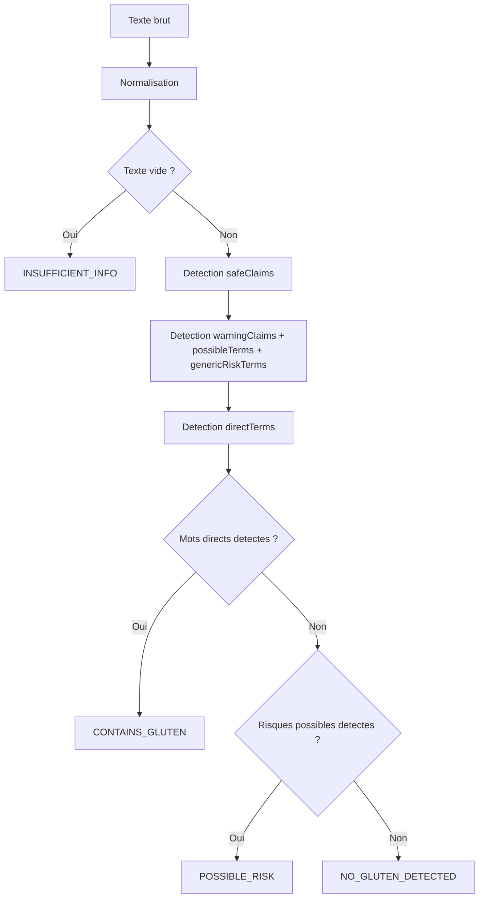

# Logique de detection du gluten

## Emplacement du moteur de regles

La logique principale se trouve dans :

```text
server/lib/glutenRules.js
```

Tests manuels :

```text
server/test-glutenRules.js
```

Le serveur appelle cette logique depuis :

```text
server/routes/analyze.js
```

## Fonction principale

La fonction exportee principale est :

```js
analyzeIngredients(text)
```

Elle retourne un objet contenant notamment :

- `status`
- `label`
- `detectedWords`
- `possibleWords`
- `safeClaims`
- `confidence`
- `normalizedText`
- `message`

## Normalisation du texte

La fonction `normalizeText` :

- Convertit en minuscules.
- Supprime les accents via normalisation Unicode.
- Remplace certaines apostrophes par des espaces.
- Supprime la ponctuation non utile.
- Compacte les espaces.

Cette etape rend la detection plus robuste pour le francais, l'anglais et l'espagnol.

## Categories de termes

| Liste | Role |
|---|---|
| `safeClaimTerms` | Mentions rassurantes comme `sans gluten`, `gluten not detected` |
| `safeExceptionTerms` | Ingredients contenant des mots generiques mais sans gluten, ex. farine de riz |
| `directTerms` | Ingredients directement lies au gluten, ex. ble, orge, wheat flour |
| `possibleTerms` | Risques ou termes ambigus, ex. traces, may contain |
| `warningClaimTerms` | Mentions explicites de traces ou risque possible |
| `genericRiskTerms` | Termes generiques comme farine/flour/starch |
| `warningStarters` | Debuts de phrases de risque, ex. peut contenir, may contain |

## Comment les ingredients sont detectes

La detection s'appuie sur `findPhraseMatches` :

- Pour les termes latins, une regex verifie les limites de mots.
- Pour les termes chinois, la recherche utilise `indexOf`.
- Les termes sont tries par longueur decroissante pour prioriser les expressions longues.

Le moteur retire certaines zones du texte avant de rechercher les risques directs :

- Mentions rassurantes.
- Mentions de risque deja classees comme warning.
- Exceptions sans gluten connues.
- Contextes commençant par `may contain`, `peut contenir`, etc.

Cette logique evite par exemple de classer automatiquement `gluten not detected` comme `CONTAINS_GLUTEN`.

## Decision du statut

La fonction `analyzeIngredients` applique la logique suivante :



## Statuts possibles

| Statut | Signification | Confiance typique |
|---|---|---|
| `CONTAINS_GLUTEN` | Terme direct detecte | `high` |
| `POSSIBLE_RISK` | Trace, ambiguite ou terme generique | `medium` |
| `NO_GLUTEN_DETECTED` | Aucun terme surveille detecte | `medium` ou `high` |
| `INSUFFICIENT_INFO` | Texte vide ou insuffisant | `low` |

## Probleme connu : contexte negatif autour de "gluten"

Un texte produit peut contenir une phrase comme :

```text
gluten not detected
```

Le risque connu est qu'un algorithme trop simple detecte seulement le mot `gluten` et classe le produit comme contenant du gluten. Dans la version analysee, `safeClaimTerms` contient deja plusieurs expressions negatives ou rassurantes, et `server/test-glutenRules.js` teste notamment `gluten not detected`.

Limite restante : si l'OCR deforme la phrase, par exemple `gluten nt detected`, `not detect gluten`, ou une traduction mal encodee, le moteur peut redevenir trop sensible au mot `gluten`.

## Amelioration sure proposee

Pour ameliorer sans rendre le systeme dangereux :

1. Conserver une logique deterministe et testee.
2. Ajouter une detection contextuelle autour du mot `gluten`.
3. Identifier les phrases negatives et rassurantes avant la detection directe.
4. Ajouter des tests de regression pour chaque expression.
5. Ne jamais transformer une mention de traces en mention sure.

Exemples de patterns a renforcer :

| Type | Exemples |
|---|---|
| Negatif anglais | `gluten not detected`, `does not contain gluten`, `no gluten detected` |
| Negatif francais | `gluten non detecte`, `ne contient pas de gluten`, `sans gluten` |
| Negatif espagnol | `sin gluten`, `gluten no detectado`, `no contiene gluten` |
| Warning | `may contain gluten`, `peut contenir du gluten`, `traces de gluten` |

Priorite de decision recommandee :

1. Detecter les warnings explicites.
2. Detecter les safe claims explicites.
3. Supprimer les zones safe du texte de recherche directe.
4. Detecter les ingredients directs restants.
5. Si conflit entre safe claim et direct ingredient, privilegier la prudence et retourner `POSSIBLE_RISK` ou `CONTAINS_GLUTEN` selon le cas.

## Points a surveiller

- Les chaines chinoises dans `glutenRules.js` semblent mal encodees dans le fichier affiche. À vérifier dans l'editeur et avec des tests Unicode reels.
- Les mots tres courts comme `ble` peuvent creer des faux positifs si l'OCR coupe des mots.
- Les termes generiques `farine`, `flour`, `starch` sont utiles mais peuvent produire des alertes prudentes sur des produits sans gluten.
- L'algorithme ne comprend pas la structure nutritionnelle officielle ; il detecte des expressions dans du texte brut.

